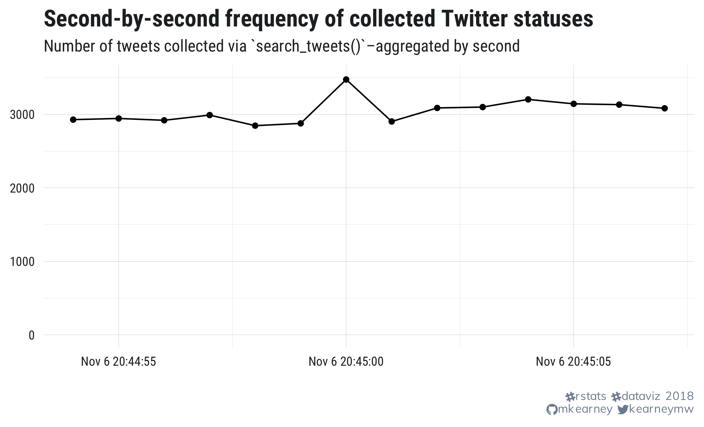
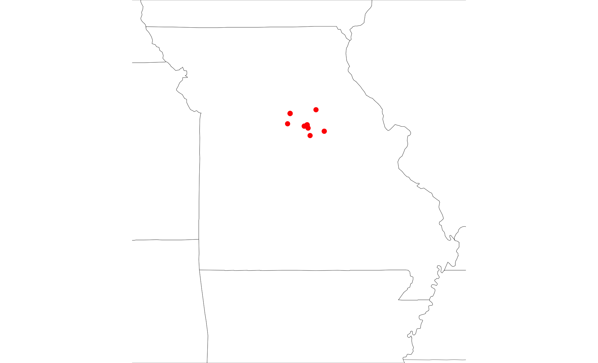

```{r setup, include=FALSE}
knitr::opts_chunk$set(
  echo = TRUE,
  eval = FALSE,
  collapse = TRUE,
  comment = "#>"
)
options(htmltools.dir.version = FALSE)
htmltools::tagList(rmarkdown::html_dependency_font_awesome())

## load libraries, set ggplot2 theme, and create datatable function
library(mwk)
theme_set(tfse::theme_mwk(base_size = 14))
set.seed(20180911)
print <- function(x, n = NULL, align = "c", digits = 3) {
  if (is.null(n)) n <- nrow(x)
  if (nrow(x) < n) n <- nrow(x)
  cat(paste(knitr::kable(x[seq_len(n), ], format = "markdown", 
    align = align, digits = digits), collapse = "\n"))
}
```

background-image: url(img/logo.png)
background-size: 350px auto
background-position: 50% 20%
class: center, bottom

View these slides at [rtweet-workshop.mikewk.com](https://rtweet-workshop.mikewk.com)

---
class: tight

## About {rtweet}

- On Comprehensive R Archive Network (CRAN)

[](https://opensource.org/licenses/MIT)[](https://cran.r-project.org/package=rtweet)

- Growing base of users

[](http://depsy.org/package/r/rtweet)

- Fairly stable

[](https://travis-ci.org/mkearney/rtweet)[](https://codecov.io/gh/mkearney/rtweet?branch=master)[](https://www.tidyverse.org/lifecycle/#maturing)

- Package website: [rtweet.info](http://rtweet.info)

[](http://rtweet.info/)

- Github repo: [mkearney/rtweet](https://github.com/mkearney/rtweet)

[](https://github.com/mkearney/rtweet/)[](https://github.com/mkearney/rtweet/)

---

## Roadmap
1. Search
1. Timelines
1. Favorites
1. Lookup tweets
1. Friends/followers
1. Lookup users
1. Lists
1. Stream

---

## Install

- Install **{rtweet}** from [CRAN](https://cran.r-project/package=rtweet).

```{r}
install.packages("rtweet")
```

- Or install the **development version** from [Github](https://github.com/mkearney/rtweet).

```{r}
#devtools::install_github("mkearney/rtweet")
```

- Load **{rtweet}**

```{r tidy=FALSE}
library(rtweet)
```


---

## httpuv

To authorize rtweet's embedded **rstats2twitter** app via web browser, the **{httpuv}** pakage is required

```{r}
## install httpuv for browser-based authentication
install.packages("httpuv")
```


---
class: inverse, center, middle

# Accessing web APIs

---

## Some background

**Application Program Interfaces** (APIs) are sets of protocols that govern interactions between sites and users.

+ APIs are similar to web browsers but with different purpose:
   - Web browsers render **visual content**
   - Web APIs manage and organize **data**
+ For public APIs, many sites only allow **authorized** users
   - Twitter, Facebook, Instagram, Github, etc.

---

## developer.twitter.com

To create your own token (with write and DM-read access), users must...

1. Apply and get approved for a developer account with Twitter
1. Create a Twitter app (fill out a form)
   - For step-by-step instructions on how to create a Twitter app and corresponding token, see **[rtweet.info/articles/auth.html](https://rtweet.info/articles/auth.html)

---
class: inverse, center, middle

# Twitter Data!

---
class: inverse, center, middle

# 1. <br /> Searching for tweets

---

## `search_tweets()`

Search for one or more keyword(s)

```{r}
rds <- search_tweets("rstats data science")
rds
```

> note: implicit `AND` between words

---

## `search_tweets()`

Search for exact phrase

```{r}
ds <- search_tweets('"data science"')
ds
```

---

## `search_tweets()`

Search for keyword(s) **and** phrase

```{r}
rpds <- search_tweets("rstats python \"data science\"")
rpds
```

---

## `search_tweets()`

+ `search_tweets()` returns 100 most recent matching tweets by default

+ Increase `n` to return more (tip: use intervals of 100)

```{r}
rstats <- search_tweets("rstats", n = 10000)
rstats
```

---

## `search_tweets()`

**PRO TIP #1**: Get the firehose for free by searching for tweets posted by
verified or non-verified tweets.

```{r}
fff <- search_tweets("filter:verified OR -filter:verified", n = 18000)
fff
ts_plot(fff, "secs")
```


---

<p style="text-align:center">  </p>

---

## `search_tweets()`

**PRO TIP #2**: Use search operators provided by Twitter, e.g.,

+ filter by language and exclude retweets and replies

```{r}
rt <- search_tweets("rstats", lang = "en", include_rts = FALSE, `-filter` = "replies")
```

+ filter only tweets linking to news articles

```{r}
nws <- search_tweets("filter:news")
```

---

+ filter only tweets with at least 100 favorites or 100 retweets

```{r}
pop <- search_tweets("min_faves:100 OR min_retweets:100")
```

+ filter by the type of device that posted the tweet.

```{r}
rt <- search_tweets("lang:en", source = '"Twitter for iPhone"')
```


---

## `search_tweets()`

**PRO TIP #3**: Search geolocation (ex: tweets within 25 miles of Columbia, MO)

```{r}
como <- search_tweets(geocode = "38.9517,-92.3341,25mi", n = 1000)
como <- lat_lng(como)
par(mar = c(0, 0, 0, 0))
maps::map("state", fill = TRUE, col = "#ffffff", 
  lwd = .25, mar = c(0, 0, 0, 0), 
  xlim = c(-96, -89), y = c(35, 41))
with(como, points(lng, lat, pch = 20, col = "red"))
```

---

<p style="text-align:center">  </p>

---

## `search_tweets()`

**PRO TIP #4**: (for developer accounts only) Use `bearer_token()` to increase rate limit to 45,000 per
fifteen minutes.

```{r}
mosen <- search_tweets(
  "mccaskill OR hawley", 
  n = 45000, 
  token = bearer_token()
)
```


---
class: inverse, center, middle

# 2. <br /> User timelines

---

## `get_timeline()`

Get the most recent tweets posted by a user.

```{r}
cnn <- get_timeline("cnn")
```

---

## `get_timeline()`

Get up to the most recent 3,200 tweets (endpoint max) posted by multiple users.

```{r}
nws <- get_timeline(c("cnn", "foxnews", "msnbc"), n = 3200)
```

---

## `ts_plot()`

Group by `screen_name` and plot hourly frequencies of tweets.

```{r}
nws %>%
  dplyr::group_by(screen_name) %>%
  ts_plot("hours")
```


---
class: inverse, center, middle

# 3. <br /> User favorites

---

## `get_favorites()`

Get up to the most recent 3,000 tweets favorited by a user.

```{r}
kmw_favs <- get_favorites("kearneymw", n = 3000)
```

---
class: inverse, center, middle

# 5. <br /> Lookup statuses

---

## `lookup_tweets()`

```{r}
## `lookup_tweets()`
status_ids <- c("947235015343202304", "947592785519173637",
  "948359545767841792", "832945737625387008")
twt <- lookup_tweets(status_ids)
```


---
class: inverse, center, middle

# 5. <br /> Getting friends/followers

---

## Friends/followers

Twitter's API documentation distinguishes between **friends** and **followers**.

+ **Friend** refers to an account a given user follows
+ **Follower** refers to an account following a given user

---

## `get_friends()`

Get user IDs of accounts **followed by** (AKA friends) [@jack](https://twitter.com/jack), the co-founder and CEO of Twitter.

```{r}
fds <- get_friends("jack")
fds
```

---

## `get_friends()`

Get friends of **multiple** users in a single call.

```{r}
fds <- get_friends(
  c("hadleywickham", "NateSilver538", "Nate_Cohn")
)
fds
```

---

## `get_followers()`

Get user IDs of accounts **following** (AKA followers) [@mizzou](https://twitter.com/mizzou).

```{r}
mu <- get_followers("mizzou")
mu
```

---

## `get_followers()`

Unlike friends (limited by Twitter to 5,000), there is **no limit** on the number of followers. 

To get user IDs of all 55(ish) million followers of @realDonaldTrump, you need two things:

1. A stable **internet** connection 
1. **Time** – approximately five and a half days

---

## `get_followers()`

Get all of Donald Trump's followers.

```{r}
## get all of trump's followers
rdt <- get_followers(
  "realdonaldtrump", 
  n = 56000000, 
  retryonratelimit = TRUE
)
```


---
class: inverse, center, middle

# 6. <br /> Lookup users

---

## Users

```{r}
## `lookup_users()`
## screen names
users <- c("hadleywickham", "NateSilver538", "Nate_Cohn")
usr <- lookup_users(users)
```

---
class: inverse, center, middle

# 7. <br /> Lists

---

## List members

```{r}
lists_members()

bp <- tweetbotornot::tweetbotornot(c(
  "kearneymw", "realdonaldtrump",
  "netflix_bot", "tidyversetweets",
  "thebotlebowski", "rodhart99"))
bp
```

---
class: inverse, center, middle

# 8. <br /> Streaming tweets

---

## `stream_tweets()`

```{r}
## `stream_tweets()`
## - "Random" **sample**
st <- stream_tweets(q = "", timeout = 30)

## - **Filter** by keyword
st <- stream_tweets(q = "realDonaldTrump,Mueller", timeout = 30)
st

ts_plot(st, "secs")
```

---

## `stream_tweets()`

```{r}
## - **Locate** by bounding box
st <- stream_tweets(q = lookup_coords("world"), timeout = 30)

stl <- lat_lng(st)

maps::map("world")
points(stl$lng, stl$lat, cex = 1, pch = 21, col = "#550000cc", bg = "#dd3333cc")
table(stl$country)
```

---

## `stream_tweets()`

```{r}
tweet_source_data <- search_tweets(
  '(filter:verified OR -filter:verified) AND (source:"Twitter for iPhone" OR source:"Twitter for Android")',
  include_rts = FALSE,
  token = bearer_token(),
  n = 40000)

table(tweet_source_data$source)
```

---
class: inverse, center, middle

# Textual analysis

---

## Sentiment

```{r}
sent <- syuzhet::get_sentiment(tweet_source_data$text)

tweet_source_data$sent <- sent

dplyr::mutate(tweet_source_data, sent = sent)

syuzhet::get_nrc_sentiment(tweet_source_data$text[1:50])

tweet_source_data <- tweet_source_data %>%
  dplyr::mutate(
    sent = syuzhet::get_sentiment(text)
  )
```

---
class: inverse, center, middle

# Machine learning

---

## Features

```{r}
tf <- textfeatures::textfeatures(tweet_source_data)
library(tidyverse)
library(gbm)
table(tweet_source_data$source)

tf$y <- tweet_source_data$source == "Twitter for iPhone"
```

---

## Machine learning data

```{r}
## all tweets
v <- search_tweets('filter:verified', n = 300)
nv <- search_tweets('-filter:verified', n = 300)
v <- dplyr::bind_rows(v, nv)
```

---

## Machine learning

```{r}
m1 <- gbm(y ~ ., data = tf[1:15000, -1], n.trees = 200)
p <- predict(m1, newdata = tf[15001:nrow(tf), -1],
  type = "response", n.trees = 200)

table(p > .50, tf$y[15001:nrow(tf)])
(2769 + 1245) / (756 + 1530 + 2769 + 1245)

summary(m1)
```

---

## Group/summarise

```{r}
tweet_source_data %>%
  group_by(source) %>%
  summarise(
    n = n(),
    users = n_distinct(user_id),
    chars = mean(nchar(text)),
    sent = mean(sent, na.rm = TRUE)
  )
```


---

## Tweetbotornot

```{r}
remotes::install_github("mkearney/tweetbotornot")
remotes::install_github("mkearney/textfeatures")

##
install.package("quanteda")
```


  
